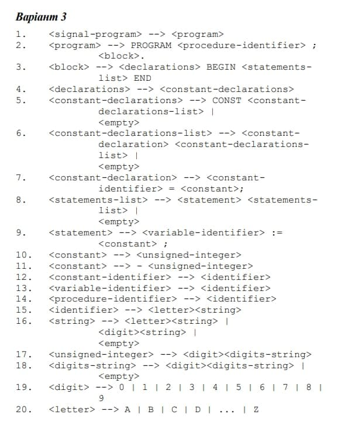

 

# Байдаус Михайло КВ-84 Варіант 3


## Обмеження 💻
``` 
* Не дозволяється використовувати однакові імена для двох і більше констант в одній підпрограмі чи на глобальному рівні
* не дозволяється використовувати однакові імена для константи чи або процедури
* не дозволяється змінювати значення константи в програмі.
```
